# Hi, I'm Mario 🤖

**I have a strong passion for programming, I take joy in building software that
adds value to the user's life.** 💻

The power of code always fascinated me. You can create anything from scratch!
It's incredibly satisfying to see a project come together, from the initial
concept to the final product.

I believe in **continuous learning** as new skills give me the power to create
new and better software!

**Let's build something awesome together! 🚀** 

* Currently working on [VOCODEX](https://github.com/C043/vocodex)
* I'm currently learning [Swift](https://www.swift.org)
* I'm currently reading ["The Linux Programming Interface: A Linux and UNIX System Programming Handbook"](https://www.goodreads.com/book/show/7672214-the-linux-programming-interface)

Projects:
* [PowerUp](https://github.com/C043/PowerUp-frontend)
* [ShellGPT](https://github.com/c043/shellgpt)
* [Scribe](https://github.com/C043/Scribe/)

**Feel free to reach out if you have any questions or want to collaborate!** 🤝

**Let's connect:**
* **GitHub:** [GitHub](https://github.com/C043)
* **LinkedIn:** [Linkedin](https://linkedin.com/in/mario-fragnito)
* **Email:** [mariofragnitoph@gmail.com](mailto:mariofragnitoph@gmail.com)

<!--
**C043/c043** is a ✨ _special_ ✨ repository because its `README.md` (this file) appears on your GitHub profile.

Here are some ideas to get you started:

- 🔭 I’m currently working on ...
- 🌱 I’m currently learning ...
- 👯 I’m looking to collaborate on ...
- 🤔 I’m looking for help with ...
- 💬 Ask me about ...
- 📫 How to reach me: ...
- 😄 Pronouns: ...
- ⚡ Fun fact: ...
-->
